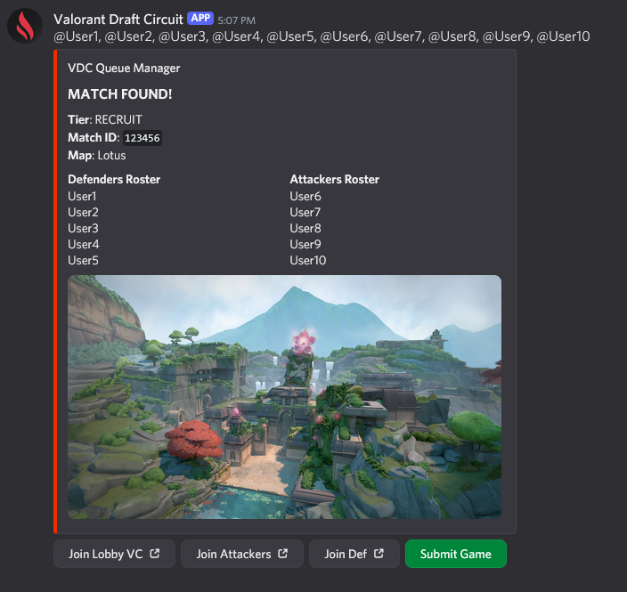

# Queue System — Requirements (Combines Only)

> **Scope:** Add a self-contained `/queue` system used **only** when `league_state = 'combines'`.  
> **Repos:**  
> - Bot: https://github.com/Valorant-Draft-Circuit/vdc-bot (This Repo)
> - Database: https://github.com/Valorant-Draft-Circuit/vdc-prisma (prisma folder)

---

## TODO: Channel layout
```
📁 [Match–TIER-12345]     ← temporary category (deleted after match)
├── 💬 match-chat-12345     ← text channel (used for pings / /match cancel)
├── 🔊 Lobby          ← everyone joins pre-game
├── 🔊 Team A         ← team-specific VC
└── 🔊 Team B         ← team-specific VC
```

## TODO: Make relax hot configurable and make it relational to how many players are in queue.

## TODO: Built an example embed that can be found here https://discord.com/channels/1027754353207033966/1419239139588702218/1426426454375403654 & https://discohook.app/?share=loJoQ1ps 



## 1) Goals

- Single **`/queue`** command for players; the bot auto-detects a player’s **tier** (no menus).
- Admins can **open/close** queues per tier; **fixed 5v5** (teamSize=5, teams=2).
- When enough players join, the system **creates a match**, DMs each player, and creates **VCs** (`Lobby`, `Team A`, `Team B`).
- **Never auto-requeue**; players must explicitly run `/queue` each time.
- **Anti-rematch**: avoid back-to-back repeats; relax after ~3 minutes if the pool is shallow.
- **Manual end:** `/match submit` pops a **modal** asking for the Tracker URL. On submit, unlock players.
- **Cancel path:** `/match cancel` → majority vote cancels; no backfill.
- **Scale safely**: Survive “100+ users press `/queue` at once” without DB outages.

Notes addressed: Player status check + priority (DE → FA/RFA → Signed), without breaking anti-rematch; and working with current DB schema and Numbers submission flow.

---

## 2) Non-Goals

- No MMR calculation/recalculation logic.
- No cross-tier matchmaking.
- No backfill of missing players.
- No modes other than **Combines**.

---

## 3) Architecture Overview

- **Redis (authoritative for live queue state)**  
  - All hot-path operations (join, build match, cancel vote bookkeeping) are **atomic Lua** scripts.  
  - Pub/Sub or Streams deliver events to workers.  :contentReference[oaicite:0]{index=0}

- **Worker(s)**  
  - Consumes Redis events to:  
    - DM players & create Discord VCs  
    - Trigger **Numbers** submission when players report results (see §7.4).  
  - **No direct writes to existing match/game tables** during queueing/match start.

- **MariaDB (Prisma)**  
  - **No changes to existing “games” or “matches” tables**.  
  - (Optional) If desired, you may add a **new, isolated audit table** for queue telemetry; not required.

---

## 4) Slash Commands & UX

### Player
- **`/queue`**  
  - Response (ephemeral): “You have joined the **{TierName}** combine queue.” 
  - Errors: “Queues only available during Combines.” / “Queue closed.” / “Already in queue or match.” / “On cooldown.”  :contentReference[oaicite:1]{index=1}

- **`/queue leave`** (only if still queued)

- **`/match cancel`** *(only in that match’s thread or DM mirror)*  
  - Adds a cancel vote; bot shows progress (e.g., `7/10 voted to cancel`).  :contentReference[oaicite:2]{index=2}

- **`/match submit`** → Modal *(Tracker URL required)*  
  - On submit: unlock players, trigger Numbers submission (see §7.4).  :contentReference[oaicite:3]{index=3}

### Admin
- **`/queue admin open <tier|all>` / `close <tier|all>`**
- **`/queue admin status`** (per-tier counts; Redis only)
- **`/queue admin reset`** (emergency: clears queues & unlocks all)
- **`/queue admin kill <match>`** (hard-cancel in emergencies)

(“Admin kill” closes your earlier TODO.)  :contentReference[oaicite:4]{index=4}

---

## 5) Redis Data Model

vdc:league_state                         -> "combines" | (others)        (STR)  
vdc:tiers                                -> {prospect,mythic,...}        (SET)  
vdc:tier:{tier}:open                     -> "1" | "0"                    (STR)  
vdc:tier:{tier}:queue:{priority}         -> LIST per priority: `DE`, `FA_RFA`, `SIGNED`  
vdc:player:{userId}                      -> {status,tier,currentMatchId,cooldownUntil,lastMatchAt} (HASH)  
vdc:player:{userId}:recent               -> {otherUserIds...}            (SET, TTL ~180s)  
vdc:match:{internalId}                   -> {tier, playersJSON, status, createdAt} (HASH)  
vdc:match:{internalId}:cancel_votes      -> {userIds...}                 (SET)  
vdc:events                               -> Redis Stream or Pub/Sub channel  
vdc:metrics:*                            -> counters for ops (optional)  :contentReference[oaicite:5]{index=5}

**Why separate per-priority queues?** It enforces DE → FA/RFA → Signed selection deterministically while still honoring anti-rematch.  
**Statuses:** `idle | queued | in_match | locked` (locked = admin/ops hold).  
**Relax rule:** anti-rematch enforced unless queue starved > 180s.  :contentReference[oaicite:6]{index=6}

---

## 6) Eligibility & Priority (Combines)

- A user may join **only if** their status is one of:  
  **`DRAFT_ELIGIBLE`**, **`FREE_AGENT`**, **`RESTRICTED_FREE_AGENT`**, **`SIGNED`**.
- **Priority order when building a match:**  
  1) DRAFT_ELIGIBLE (DE)  
  2) FREE_AGENT or RESTRICTED_FREE_AGENT (FA/RFA)  
  3) SIGNED

**Implementation detail:**  
Maintain **three Redis queues per tier** (see §5). The matchmaker pulls from them in priority order until filling 10 slots (5v5), while the anti-rematch rule may skip a candidate and peek deeper. If a higher-priority queue is empty, pull from the next one. Starvation relaxation (after ~180s) can temporarily ignore priority/anti-rematch to get games moving.

TODO: having one or two 'veterans' (FA or SIGNED) can help bridge the social gap between newer players and older ones, as well as provide a guiding voice to newer players who may not know VDC procedures.

---

## 7) Core Flows

### 7.1 Join Queue (`/queue`)
1. Validate **Combines active** (global or per-tier flag).  
2. Resolve player **tier** (profile cache → DB on miss).  
3. Validate **eligibility status** ∈ {DE, FA, RFA, SIGNED}.  
4. **Lua (atomic)**:
   - Ensure not `queued/in_match/locked`, cooldown passed, tier open.  
   - Push the user into `vdc:tier:{tier}:queue:{PRIORITY}` based on their status.  
   - Set `status=queued`, `tier`, `joinedAt`.  
   - Emit `queue_join` event.  :contentReference[oaicite:7]{index=7}
5. Reply with tier confirmation.

### 7.2 Build Match (Worker)
1. Triggered by events or polling.  
2. If **(DE + FA/RFA + SIGNED)** queue lengths combined ≥ 10:
   - **Lua (atomic)** picks 10 users, **respecting priority order** and **anti-rematch**; if the pool is starved > 180s, relax anti-rematch (and if needed, priority) to fill.  
   - Pop chosen users from their respective priority queues, set `status=in_match`, set `currentMatchId` (internal Redis ID).  
   - Write `vdc:match:{internalId}`; add `recent` pairs (TTL ~180s).  
     - TODO: It should set the recent time once the game finishes as Val games can be 45mins +
   - Emit `match_created`.  :contentReference[oaicite:8]{index=8}
3. Worker side-effects:
   - DM players with teams and provide links to `Lobby`, `Team A`, `Team B`.  
   - Create VC category + channels; store references in the Redis match record.  
   - **No DB writes** to the existing games/matches here.

### 7.3 Cancel
- `/match cancel` adds the voter to `vdc:match:{internalId}:cancel_votes`.  
- If votes ≥ configured threshold (default 80%):  
  - Mark Redis match `canceled`, set all players `status=idle`, delete VCs, archive thread. (No “backfill”.)  :contentReference[oaicite:9]{index=9}

### 7.4 Submit / Complete (Tracker → Numbers)
- `/match submit` → Modal requests Tracker URL (validate against:  
  `/^https:\/\/tracker.gg\/valorant\/match\/([a-z0-9]{8})-([a-z0-9]{4}-){3}([a-z0-9]{12})$/`)  :contentReference[oaicite:10]{index=10}
- On submit:
  1) Parse Riot **`gameID`** from the URL via the regex above.  
  2) Determine **tier** from the Redis match record.  
  3) POST to **Numbers**: `https://numbers.vdc.gg/gameSubmit` with body `{ gameID, tier, type: 'combines' }`.  
     - This creates the record via existing pipelines (you **own neither the ID nor the schema**).  
  4) In Redis: mark `status=completed`, set `endedAt`, unlock players (`status=idle`, small cooldown).  
  5) Clean up VCs & threads.

**Why this flow?** Your “games” table is the canonical store created by Numbers, and **Riot’s gameID exists only after the game ends**—so we keep all pre-game state in Redis and **do not** touch existing tables.

---

## 8) Concurrency, Scale & Safety

- **No table locks**; all hot concurrency handled by Redis + Lua.  
- The bot and workers use small DB pools; DB only sees Numbers’ submissions after matches, not hot-path queue traffic.  
- **Idempotency:** Redis internal match ID prevents duplicate side effects if a worker restarts.  
- **Backpressure:** If Discord is rate-limited, defer DMs/VC; Redis holds truth and players are already matched.  
- **Never auto-requeue.**  :contentReference[oaicite:11]{index=11}

---

## 9) Anti-Rematch Rules

- Maintain per-player `recent` set with TTL ~180s.  
- Greedy selection avoids pairing players who just played together/against.  
- After **relax window** (~3 min), allow repeats if needed to fill.  :contentReference[oaicite:12]{index=12}

---

## 10) Permissions & Security

- Admin command gating by configured **Admin role ID**.  
- `/match cancel` and `/match submit` only usable by players in that match (in thread or DM mirror).  
- Tracker URL validation via the regex above.  :contentReference[oaicite:13]{index=13}

---

## 11) Configuration

- `REDIS_URL`, `DATABASE_URL`  
- `QUEUE_RELAX_SECONDS` (default 180)  
- `MATCH_CANCEL_THRESHOLD` (default 80%)  
- VC creation toggle and channel category template.  :contentReference[oaicite:14]{index=14}

---

## 12) Observability

- Redis counters: `vdc:metrics:queues_joined`, `matches_created`, `matches_canceled`, `matches_completed`.  
- Worker logs per event with internal match ID.  
- `/queue admin status` shows per-tier queue length & open/closed.  :contentReference[oaicite:15]{index=15}

---

## 13) Failure Modes & Recovery

- **Redis down:** disable `/queue` with a friendly error.  
- **DB down:** queue/matching still work; `/match submit` surfaces a friendly error if Numbers is unreachable and retries later.  
  - TODO: It should disable queues and return a friendly error if database goes down.
- **Discord rate limits:** delay DMs/VC creation; state is safe in Redis.  
- **Emergency reset:** `/queue admin reset` clears queues & unlocks all players.  :contentReference[oaicite:16]{index=16}

---

## 14) Testing Plan

- Unit-test Lua join/build scripts (eligibility, priority & anti-rematch).  
- Load test 100–500 concurrent `/queue`.  
- E2E: join → match → cancel → requeue; join → match → submit (Numbers POST) → unlock.  :contentReference[oaicite:17]{index=17}

---

## 15) Rollout Plan

1) Deploy Redis + Lua scripts.  
2) Ship bot with `/queue`, `/match cancel`, `/match submit`, and the worker.  
3) Dry-run in a test guild; verify VC creation & Numbers submission.  
4) Enable in production when `league_state = 'combines'`; monitor `/queue admin status`.  :contentReference[oaicite:18]{index=18}

---

## 16) File/Code Additions (Bot Repo)

- `src/redis/index.ts` (client + loader)  
- `src/redis/scripts/join.lua`, `build_match.lua` (eligibility + priority aware)  
- `src/workers/matcher.ts`  
- Commands:  
  - `src/commands/queue.ts`  
  - `src/commands/match-cancel.ts`  
  - `src/commands/match-submit.ts`  
  - `src/commands/admin/queue-open.ts`, `queue-close.ts`, `queue-status.ts`, `queue-reset.ts`

Notes addressed: keep current command folder style; add admin kill; no schema rewrites.  :contentReference[oaicite:19]{index=19}

---

## 17) Future Work

- Auto-detect Riot `gameID` from Tracker and submit without manual entry (once players mark done).  
- Optional team balancing heuristic (MMR variance).  
- Prometheus/Grafana dashboard for live status.  :contentReference[oaicite:20]{index=20}

---

## 18) Acceptance Criteria

- `/queue` routes to correct tier; success message returned.  
- With **10 players** in a tier, a **match is created**; all players DM’d + VC links.  
- `/match cancel` cancels with majority; players unlocked.  
- `/match submit` with a valid Tracker URL triggers **Numbers** POST and unlocks players.  
- No auto-requeue at any time.  
- Handles **100+ simultaneous joins** without DB slowdowns or crashes.  
- Works **only** when `league_state = 'combines'`.  :contentReference[oaicite:21]{index=21}
